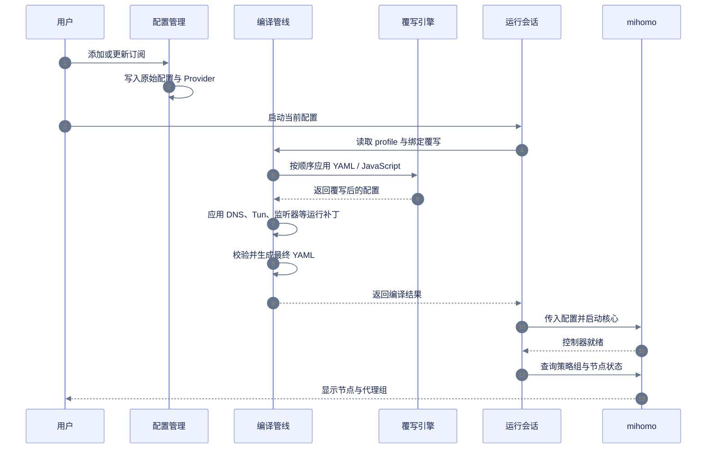
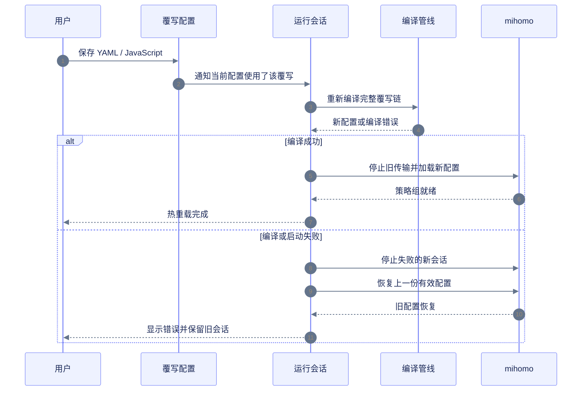
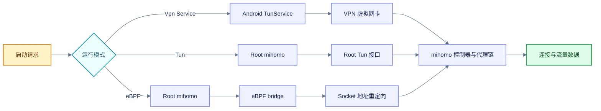
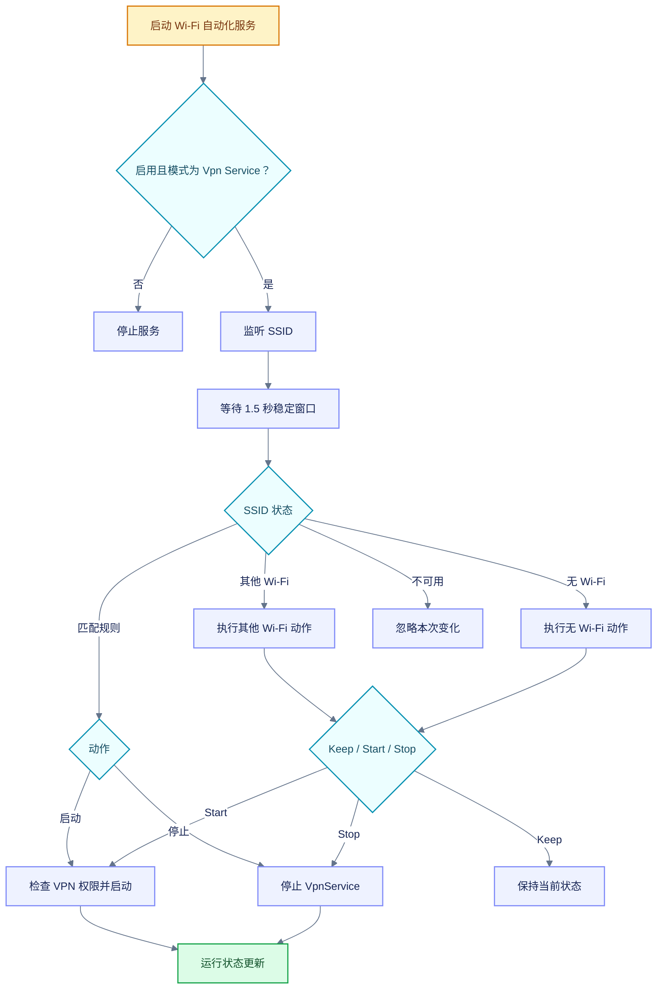
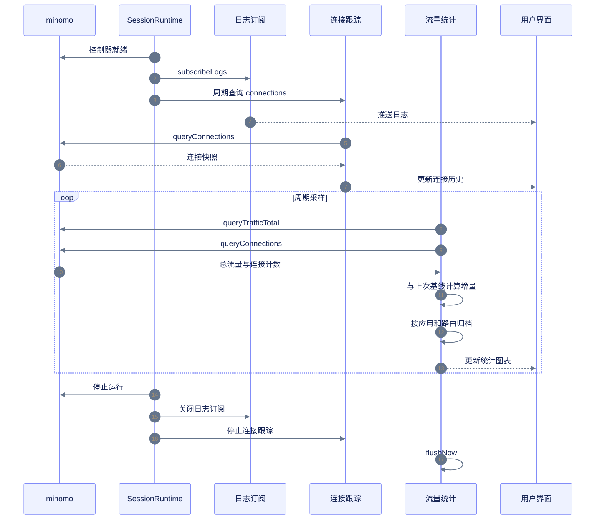
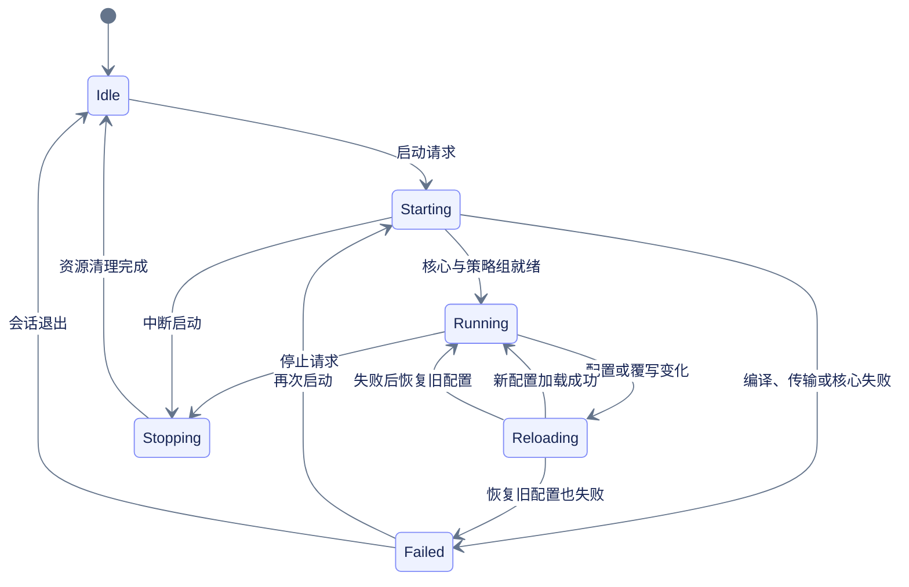

YumeBox is responsible for managing configuration, overwriting and running sessions; mihomo is responsible for parsing nodes, establishing connections and providing running data.

## Overall architecture

This diagram shows the complete architecture of YumeBox from configuration entry to running data: how configuration, override, session, core, system access and observation data are connected to each other.

<Frame></Frame>

## Configuration enablement and node resolution

The configuration update is only responsible for obtaining and submitting the new configuration; when it is actually started, the running session will compile the current configuration and overwrite chain again, and then wait for the mihomo controller to provide the policy group.



```yaml 运行模式对配置的影响 diff.yaml icon="file-code" lines
tun:
  enable: true # [!code --]
  enable: false # [!code ++]
  auto-route: true # [!code --]
  auto-route: false # [!code ++]
  auto-detect-interface: true # [!code --]
  auto-detect-interface: false # [!code ++]
```

In **Vpn Service** and **eBPF** modes, the runtime patch will close the above Tun entry; **Tun** mode will retain the Tun configuration.

## Custom overwriting and hot reloading

After the custom override is saved, YumeBox will re-apply the override chain currently being used by the configuration. The running configuration will not modify the original subscription text; when reloading fails, the running session will try to restore the last valid configuration.



```yaml 旧配置.yaml icon="file-code" lines
mixed-port: 7890
```

```yaml 新覆写.yaml icon="file-code" lines
mixed-port: 10801
```

```yaml 热重载结果 diff.yaml icon="file-code" lines
mixed-port: 7890 # [!code --]
mixed-port: 10801 # [!code ++]
```

Tun configurations containing a list of application package names will not re-establish the VPN device when reloaded on the fly; such changes will be logged to take effect the next time Tun is established.

## Startup mode and service process

The three modes share the configuration compilation process, but the hosts that take over the traffic are different: **Vpn Service** uses the Android VPN service, **Tun** uses the Root mihomo process, and **eBPF** starts the eBPF bridge outside the Root mihomo process.



The startup request will first check the remote controller, running status, repeated startup and built-in Geo data before entering the corresponding host. Running sessions continuously refresh status, policy groups, logs, and traffic data.

## Wi‑Fi Automation

Wi‑Fi Automation only runs in **Vpn Service** mode. It monitors the SSID by an independent front-end service; rules are applied only after the network status is stable to avoid repeated starts and stops caused by instantaneous changes.



## Connection, log and traffic statistics

After running the session to establish the controller, enable log subscription and connection tracking at the same time. The connections, policy groups, real-time speeds, and historical statistics queried by the interface all come from running data, not overwritten files.



Traffic statistics will be archived by connection increment, application identity and last-hop route; the unattributed portion will be recorded in the unattributed bucket. When the current configuration is switched, the total traffic is rolled back, or the connection count is reset, the counter will re-establish the baseline to avoid miscalculating old sessions into new sessions.

## Running status loop



This status loop explains why hot reload failure does not necessarily equal agent stop: if restoration of the old configuration succeeds, the session still returns to Running, with the reason for restoration being logged.
