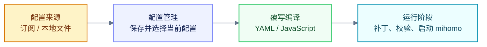

<Info> override only affects the application configuration and does not change the original configuration. It only takes effect when used. </Info>

The function of overwriting can be summarized as: reading the original configuration, applying the bound overrides in sequence, and generating the configuration used for this run.



## Built-in override

| Name | Function |
| --- | --- |
| Prevent DNS leaks | Add anti-leak rules and enable `fake-ip`. |
| Add direct connection rules | Insert Baidu and Tencent rules at the beginning of the rule list. |
| Pudding Dog Subscription Conversion | Add rule sets, proxy groups and diversion rules. |
| ACL4SSR Online Full | Adds the complete ACL4SSR rule set and offload group. |

<Info>The built-in override cannot be edited or deleted. Please copy it first if you need to modify it. </Info>

## Apply override

The effect of the two entrances is the same, and the selected override will be applied to the subscription.

<Steps>
  <Step title="From the subscription card app">
    Open the subscription card and go to **Edit Subscription → Setting Type → Override Configuration**.

    <Frame></Frame>
  </Step>

  <Step title="Configure application from override">
    Select overwrite, click **Apply**, check the target subscription and confirm to save.

    <Frame></Frame>
  </Step>
</Steps>


### Execution order

When multiple overrides are applied to the same subscription, YumeBox executes them in list order; later overrides can modify previous results.

```yaml 原始配置.yaml icon="file-code" lines
mixed-port: 7890
rules:
  - DOMAIN-SUFFIX,old.example,DIRECT
  - MATCH,PROXY
```

```yaml 第一份覆写.yaml icon="file-code" lines
mixed-port: 10801
rules-start:
  - DOMAIN-SUFFIX,first.example,DIRECT
```

```yaml 第二份覆写.yaml icon="file-code" lines
mixed-port: 10802
rules-end:
  - DOMAIN-SUFFIX,last.example,PROXY
```

```yaml 最终结果 diff.yaml icon="file-code" lines
mixed-port: 7890 # [!code --]
mixed-port: 10802 # [!code ++]
rules:
  - DOMAIN-SUFFIX,first.example,DIRECT # [!code ++]
  - DOMAIN-SUFFIX,old.example,DIRECT
  - DOMAIN-SUFFIX,last.example,PROXY # [!code ++]
  - MATCH,PROXY
```

Subsequent overwrites will not re-read the original subscription text, but will receive the results of the previous overwrite.

## Custom override

| Type | Purpose | Documentation |
| --- | --- | --- |
| YAML | Fixed field, rule and list modifications. | [YAML syntax](./yaml) |
| JavaScript | Conditional judgment, dynamic processing and remote reading. | [JavaScript syntax](./js-override) |
