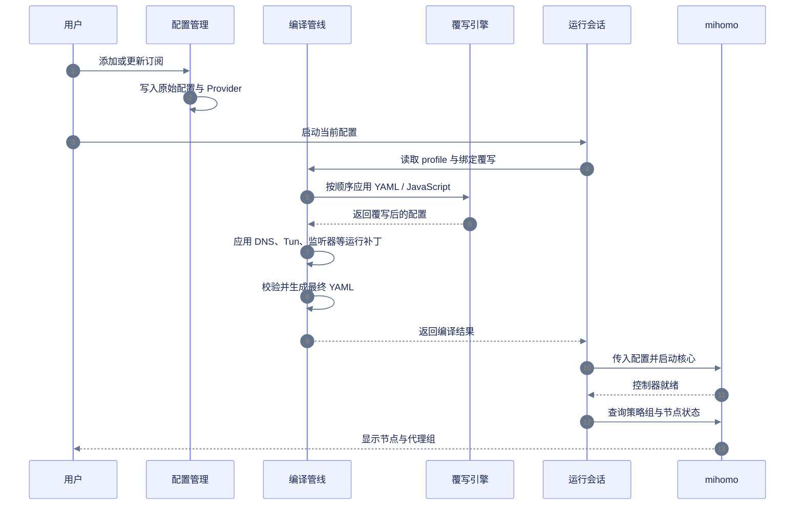
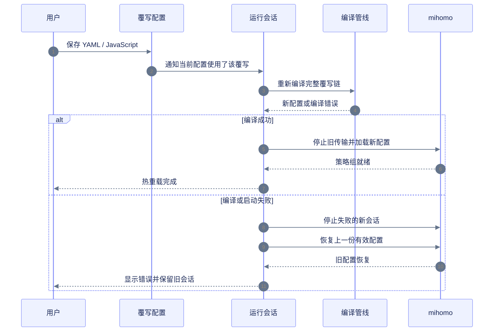
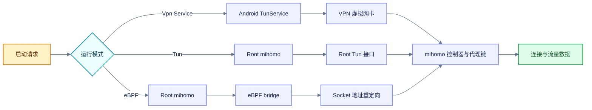
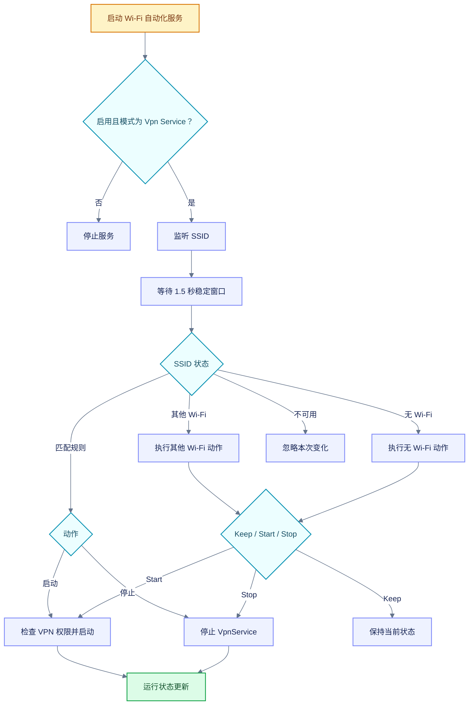
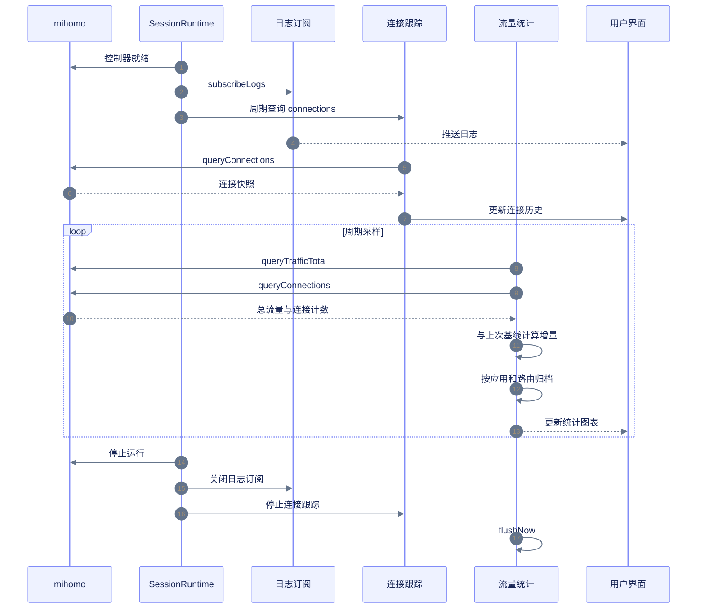
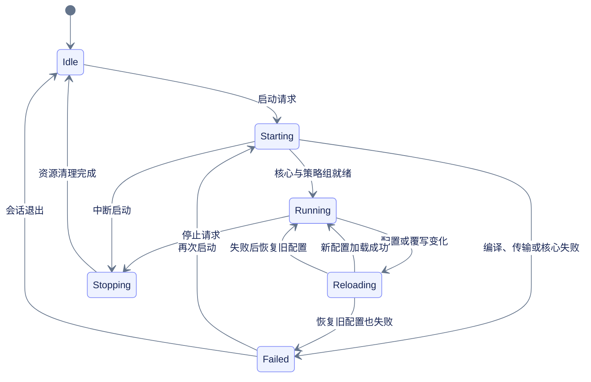

YumeBox 负责管理配置、覆写和运行会话；mihomo 负责解析节点、建立连接并提供运行数据.

## 总体架构

这张图展示 YumeBox 从配置入口到运行数据的完整架构：配置、覆写、会话、核心、系统接入与观测数据彼此如何连接.

<Frame></Frame>

## 配置启用与节点解析

配置更新只负责取得并提交新的配置；真正启动时，运行会话会再次编译当前配置和覆写链，然后等待 mihomo 控制器提供策略组.



```yaml 运行模式对配置的影响 diff.yaml icon="file-code" lines
tun:
  enable: true # [!code --]
  enable: false # [!code ++]
  auto-route: true # [!code --]
  auto-route: false # [!code ++]
  auto-detect-interface: true # [!code --]
  auto-detect-interface: false # [!code ++]
```

在 **Vpn Service** 和 **eBPF** 模式中，运行时补丁会关闭上述 Tun 入口；**Tun** 模式会保留 Tun 配置.

## 自定义覆写与热重载

自定义覆写保存后，YumeBox 会重新应用当前配置正在使用的覆写链.运行中的配置不会修改订阅原文；重新加载失败时，运行会话会尝试恢复上一份有效配置.



```yaml 旧配置.yaml icon="file-code" lines
mixed-port: 7890
```

```yaml 新覆写.yaml icon="file-code" lines
mixed-port: 10801
```

```yaml 热重载结果 diff.yaml icon="file-code" lines
mixed-port: 7890 # [!code --]
mixed-port: 10801 # [!code ++]
```

Tun 包含应用包名列表的配置在运行中重新加载时不会重新建立 VPN 设备；这类变化会记录为下一次建立 Tun 时生效.

## 启动模式与服务进程

三种模式共享配置编译流程，但接管流量的宿主不同：**Vpn Service** 使用 Android VPN 服务，**Tun** 使用 Root mihomo 进程，**eBPF** 在 Root mihomo 进程之外再启动 eBPF bridge.



启动请求会先检查远程控制器、运行状态、重复启动和内置 Geo 数据，再进入对应宿主.运行中的会话会持续刷新状态、策略组、日志和流量数据.

## Wi‑Fi 自动化

Wi‑Fi 自动化只在 **Vpn Service** 模式运行.它由独立的前台服务监测 SSID；网络状态稳定后才应用规则，避免瞬时变化造成重复启停.



## 连接、日志与流量统计

运行会话建立控制器后，同时开启日志订阅和连接跟踪.界面查询到的连接、策略组、实时速度和历史统计都来自运行数据，而不是覆写文件.



流量统计会按连接增量、应用身份和最后一跳路由归档；无法归属的部分会记录到未归属桶.切换当前配置、总流量回退或连接计数重置时，统计器会重新建立基线，避免把旧会话误算到新会话.

## 运行状态回路



该状态回路解释了为什么**热重载失败**不一定等于代理停止：如果旧配置恢复成功，会话仍然回到 **Running**，同时记录恢复原因.
