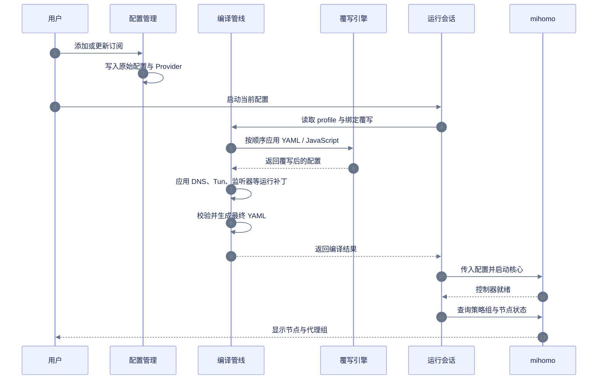
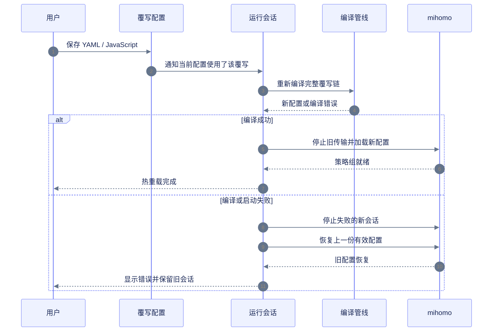
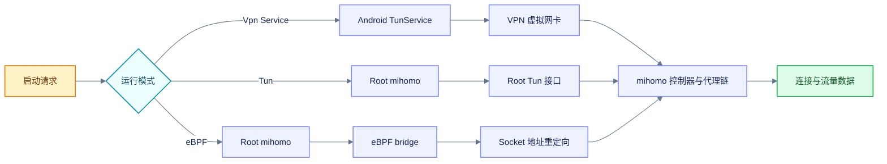
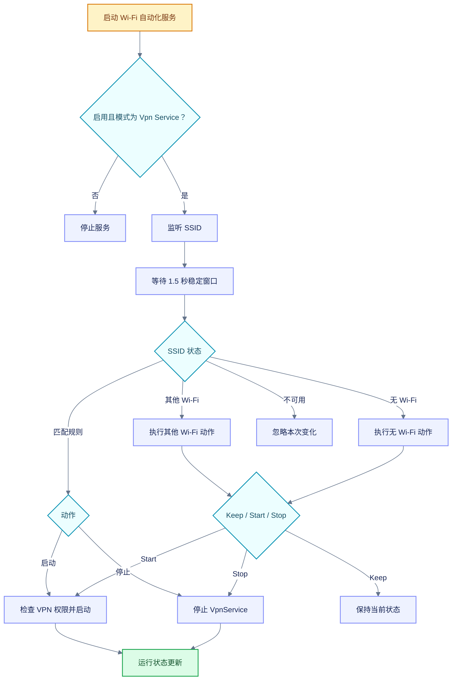
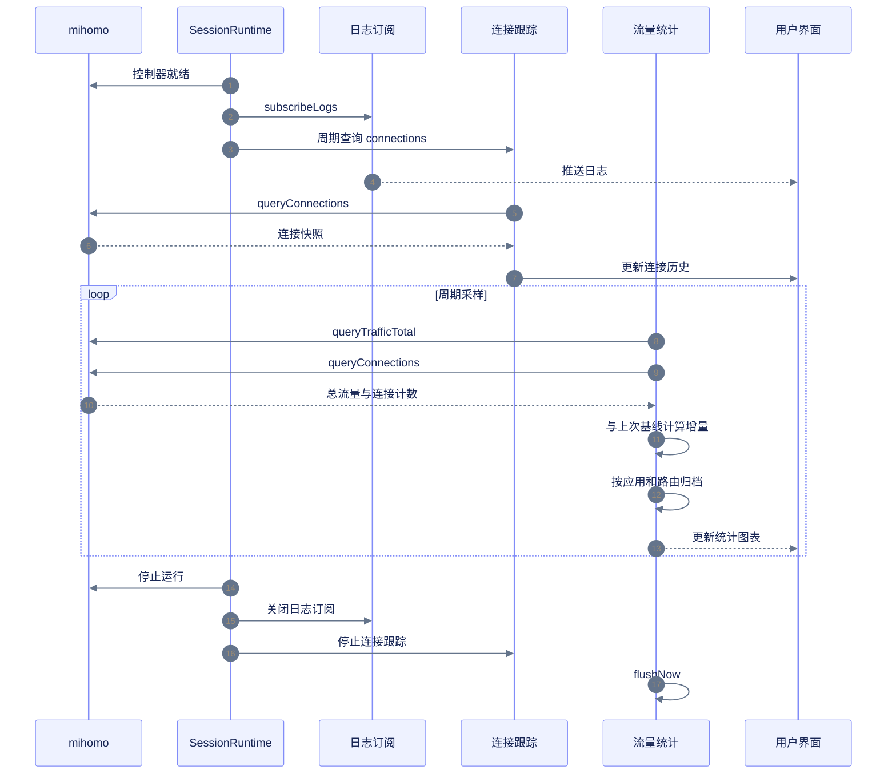
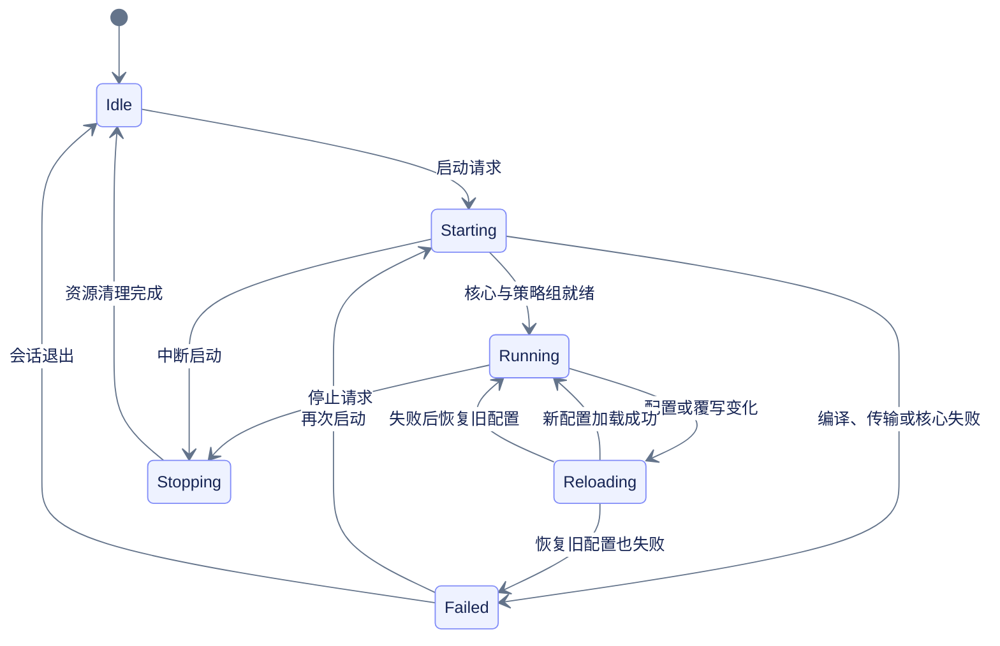

DreamBox は、構成の管理、セッションの上書き、実行を担当します. mihomo は、ノードの解析、接続の確立、実行データの提供を担当します.

## 全体的なアーキテクチャ

この図は、設定エントリから実行データに至る、YumeBox の完全なアーキテクチャを示しています.つまり、設定、オーバーライド、セッション、コア、システム アクセス、および観測データがどのように相互に接続されているかを示しています.

<Frame></Frame>

## 構成の有効化とノードの解決

構成の更新は、新しい構成の取得と送信のみを行います.実際に開始されると、実行中のセッションは現在の設定をコンパイルしてチェーンを再度上書きし、mihomo コントローラーがポリシー グループを提供するのを待ちます.



```yaml 运行模式对配置的影响 diff.yaml icon="file-code" lines
tun:
  enable: true # [!code --]
  enable: false # [!code ++]
  auto-route: true # [!code --]
  auto-route: false # [!code ++]
  auto-detect-interface: true # [!code --]
  auto-detect-interface: false # [!code ++]
```

**VPN サービス** および **eBPF** モードでは、ランタイム パッチによって上記の Tun エントリが閉じられます. **Tun** モードでは Tun 構成が保持されます.

## カスタム上書きとホットリロード

カスタム オーバーライドが保存されると、YumeBox は現在構成で使用されているオーバーライド チェーンを再適用します.実行コンフィギュレーションでは、元のサブスクリプション テキストは変更されません.リロードが失敗すると、実行中のセッションは最後の有効な構成の復元を試みます.



```yaml 旧配置.yaml icon="file-code" lines
mixed-port: 7890
```

```yaml 新覆写.yaml icon="file-code" lines
mixed-port: 10801
```

```yaml 热重载结果 diff.yaml icon="file-code" lines
mixed-port: 7890 # [!code --]
mixed-port: 10801 # [!code ++]
```

アプリケーション パッケージ名のリストを含む Tun 構成は、オンザフライでリロードしても VPN デバイスを再確立しません.このような変更はログに記録され、次回 Tun が確立されたときに有効になります.

## 起動モードとサービスプロセス

3 つのモードは構成コンパイル プロセスを共有しますが、トラフィックを引き継ぐホストは異なります.**Vpn Service** は Android VPN サービスを使用し、**Tun** は Root mihomo プロセスを使用し、**eBPF** は Root mihomo プロセスの外で eBPF ブリッジを開始します.



起動リクエストは、対応するホストに入る前に、まず送信機、実行ステータス、繰り返し起動、内蔵の地理データをチェックします.セッションを実行すると、ステータス、ポリシー グループ、ログ、トラフィック データが継続的に更新されます.

## Wi-Fi オートメーション

Wi-Fi オートメーションは **VPN サービス** モードでのみ実行されます.独立したフロントエンド サービスによって SSID を監視します.ルールは、瞬間的な変化によって引き起こされる繰り返しの起動と停止を避けるために、ネットワークのステータスが安定した後にのみ適用されます.



## 接続、ログ、トラフィック統計

セッションを実行してコントローラーを確立した後、ログ サブスクリプションと接続追跡を同時に有効にします.インターフェイスによってクエリされる接続、ポリシー グループ、リアルタイム速度、および履歴統計はすべて、上書きされたファイルではなく、実行中のデータから取得されます.



トラフィック統計は、接続増分、アプリケーション ID、ラストホップ ルートごとにアーカイブされます.帰属されていない部分は、帰属されていないバケットに記録されます.現在の設定が切り替えられるか、合計トラフィックがロールバックされるか、接続数がリセットされると、カウンタはベースラインを再確立して、古いセッションが新しいセッションに誤って計算されるのを防ぎます.

## ステータスループの実行中



このステータス ループは、ホット リロードの失敗が必ずしもエージェントの停止と一致しない理由を説明しています.古い設定の復元が成功した場合でも、セッションは引き続き実行中に戻り、復元の理由がログに記録されます.
