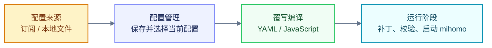

<Info> オーバーライドはアプリケーション構成にのみ影響し、元の構成は変更されません.使用した場合にのみ効果を発揮します. </Info>

上書きの機能は、元の構成を読み取り、バインドされたオーバーライドを順番に適用し、この実行に使用される構成を生成するように要約できます.



## 組み込みオーバーライド

|名前 |機能 |
| --- | --- |
| DNS リークを防ぐ |漏洩防止ルールを追加し、`fake-ip` を有効にします. |
|直接接続ルールを追加する | Baidu と Tencent のルールをルール リストの先頭に挿入します. |
|プリンドッグのサブスクリプション変換 |ルール セット、プロキシ グループ、転送ルールを追加します. |
| ACL4SSR オンラインフル |完全な ACL4SSR ルール セットとオフロード グループを追加します. |

<Info>組み込みオーバーライドは編集または削除できません.変更する必要がある場合は、まずコピーしてください. </Info>

## オーバーライドを適用する

2 つの入り口の効果は同じで、選択したオーバーライドがサブスクリプションに適用されます.

<Steps>
  <Step title="サブスクリプションカードアプリから">
    サブスクリプション カードを開き、**サブスクリプションの編集 → 設定タイプ → 構成の上書き** に移動します.

    <Frame></Frame>
  </Step>

  <Step title="オーバーライドからアプリケーションを構成する">
    [上書き] を選択し、[**適用**] をクリックして、対象のサブスクリプションを確認し、保存を確認します.

    <Frame></Frame>
  </Step>
</Steps>


### 実行順序

複数のオーバーライドが同じサブスクリプションに適用される場合、YumeBox はそれらをリスト順に実行します.後でオーバーライドすると、以前の結果が変更される可能性があります.

```yaml 原始配置.yaml icon="file-code" lines
mixed-port: 7890
rules:
  - DOMAIN-SUFFIX,old.example,DIRECT
  - MATCH,PROXY
```

```yaml 第一份覆写.yaml icon="file-code" lines
mixed-port: 10801
rules-start:
  - DOMAIN-SUFFIX,first.example,DIRECT
```

```yaml 第二份覆写.yaml icon="file-code" lines
mixed-port: 10802
rules-end:
  - DOMAIN-SUFFIX,last.example,PROXY
```

```yaml 最终结果 diff.yaml icon="file-code" lines
mixed-port: 7890 # [!code --]
mixed-port: 10802 # [!code ++]
rules:
  - DOMAIN-SUFFIX,first.example,DIRECT # [!code ++]
  - DOMAIN-SUFFIX,old.example,DIRECT
  - DOMAIN-SUFFIX,last.example,PROXY # [!code ++]
  - MATCH,PROXY
```

後続の上書きでは、元のサブスクリプション テキストが再度読み取られることはありませんが、前回の上書きの結果を受け取ります.

## カスタムオーバーライド

|タイプ |目的 |ドキュメント |
| --- | --- | --- |
|ヤムル |フィールド、ルール、リストの変更を修正しました. | [YAML 構文](./yaml) |
| JavaScript |条件判断、動的処理、リモート読み取り. | [JavaScript 構文](./js-override) |
